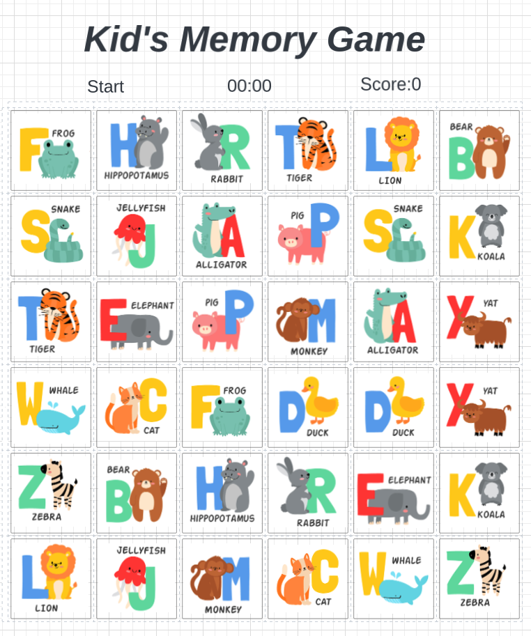
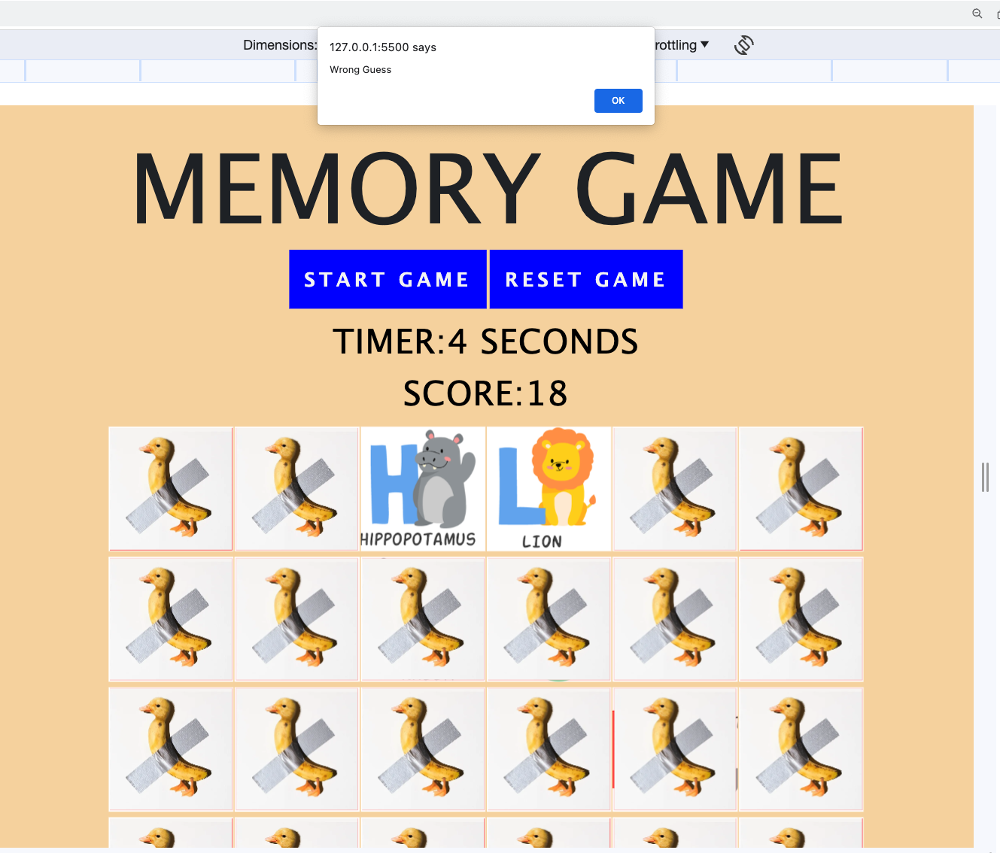
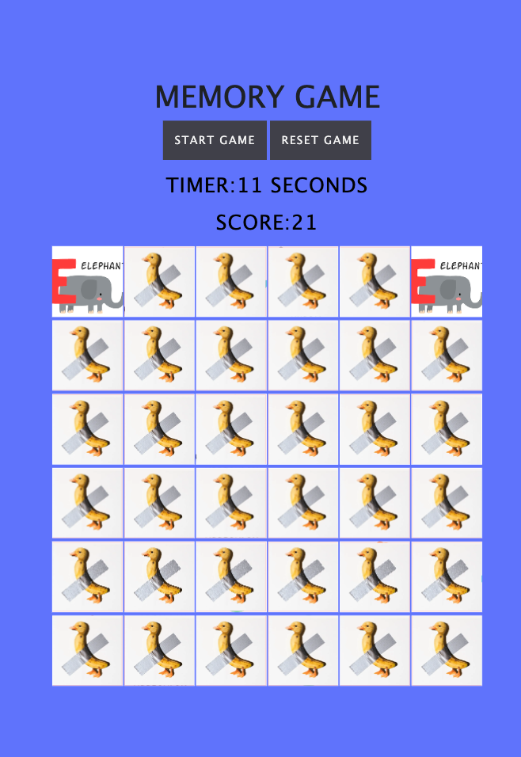
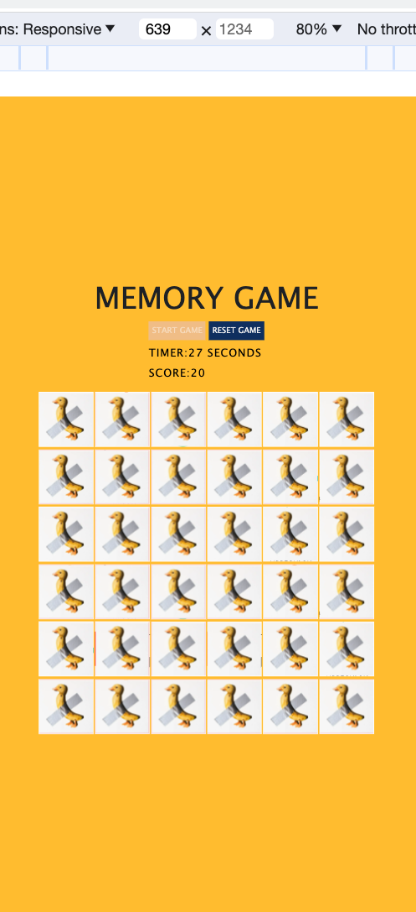

**Memory Game** 

**Description**  
Concentration is a classic card-matching game that challenges your memory and concentration. The game consists of a set of face-down cards, and the objective is to find pairs of matching cards by flipping them over two at a time. The game is won when all the pairs have been successfully matched.

**Gameplay / User Experience**   
 When you start the game, you'll be presented with a grid of 36 face-down cards.
Click on any two cards to flip them over and reveal their content.
If the two cards match, they will remain face-up, and you'll earn a point.
If the cards do not match, they will be flipped back face-down.
Continue to find matching pairs until all cards are face-up, and you win the game. The game begins with an initial score of 20, and if your score reaches zero, the game is over.

**Concentration Gameplay** 

**Technologies Used**   
HTML, CSS, JavaScript, Bootstrap and Flex

**Acknowledgements**   
I would like to express my gratitude to the following individuals who have contributed to or inspired this project:

- Jan Horak: For his invaluable guidance, support, and mentorship throughout the development process.
- Other instructional team members: For their expertise, feedback, and assistance that greatly enriched this project.

Thank you for your valuable contributions and support!
I would like to express my acknowledgement to the following sources for their contributions to this project:

- [Chive](https://www.example.com/chive): For providing photos and images used in the project.
- [Lucid](https://www.example.com/lucid): For wireframing and design resources.
- [Freepik](https://www.example.com/freepik): For offering design assets and graphics used in the project.

**How to Play / Install**   
To play the Concentration Game, follow these steps:

- 1: Clone this repository to your local machine.
- 2: Open the project directory and navigate to the game's main HTML file (e.g., index.html).
- 3: Open the HTML file in a web browser.
- 4: Start the game and enjoy!

**Future Features**   
Here are some potential features and improvements we plan to implement in the future:

- Add a timer symbol next to the timer.
- Implement a feature that displays the card layout briefly at the beginning of the game before gameplay begins. .
- Create multiple levels of difficulty with varying grid sizes.
- Add different themes and card designs to enhance the visual experience.
- Enable multiplayer mode for competitive play.
- Add an animation effect to the card flipping action
- Format the timer to display in the MM:SS format

